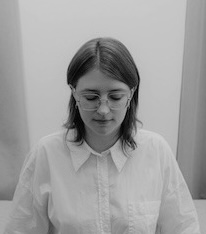
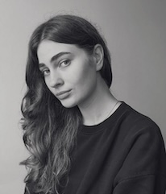
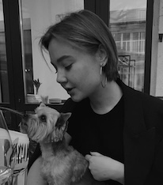
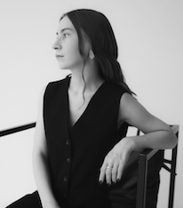

Студію MUSO (раніше – Landusheva Buro) засновано в 2017 в Києві

**Філософія**

Наша віра в архітектуру - це віра в її тактильність і чесність. Для нас це означає відкидання зайвого і зосередження на масивних формах. Кожен наш проект виходить з ретельного вивчення контексту. Вкладення пристрасті у кожну роботу є основою, і ми прагнемо створювати атмосферу, яка виводить нас із метушливого світу, де зараз живемо. Наша мета - дати комфорт людині як під час проектування, та і під час буття в просторі. Ми не відмовляюся від технологій, проте вважаємо, що баланс між майбутнім, сьогоденням та минулим приносить автентичність простору.

**Команда**

У нашій студії кожен проект – це результат спільної творчості талановитих дизайнерів, які стоять за кулісами майбутнього простору  
  

**Настя**  
Засновниця студії  
Займається комунікацією та дизайном  
Надихається Axel Vervoordt, Faye Toogood, Michael Anastassiades
  

**Марія**  
Майстриня детальних креслень  
Не тільки відчуває пропорції, а й вміє передати їх через креслення так, що приміщення "оживає" при реалізації.  
Надихається estudio DIIR, John Pawson, Norm Architects, CJN Studio, Alvar Aalto, Peter Zumthor, Jan Kinsbergen
  

**Маша**  
Займається розробкою дизайну  
Наш креативний мозок. Від першої ідеї до останнього штриху, Маша завжди знаходить спосіб зробити дизайн особливим.   
Надихається Alvar Aalto, Aldo Rossi, Vico Magistretti. Із сучасних - Plantea Estudio, Studio Contekst, Fala Atelier
  

**Оля**  
Займається розробкою дизайну  
Дизайнерка, яка любить складні задачі. Для неї немає неможливих завдань – лише нові можливості для творчості.     
Надихається Crude, Studiopepe, Vincent van Duysen, Norm Architects
  

