Процес проєктування може бути скорочений під потреби конкретного простору, але в загальному виглядає так:

{}

### Початкова обширна консультація

- великий-великий документ, щоб не упустити дрібничку

Виявлення ваших потреб та з описом варіантів, як реалізувати те чи інше вподобання - в результаті ви **отримуєте комерційну пропозицію** з деталями роботи:

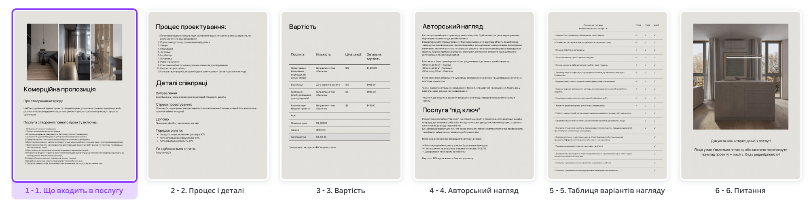

### Заключення договору

- договір та поетапна оплата – наше все

Це документ, який містить умови співпраці, права та обов'язки сторін, терміни виконання робіт, вартість та інші деталі, які допомагають запобігти можливим непорозумінням та конфліктам у майбутньому. Заключення договору дозволяє **захистити інтереси обох сторін**, забезпечити чіткість та прозорість в процесі роботи над проектом, а також підвищити довіру та взаєморозуміння між клієнтом та дизайнером.

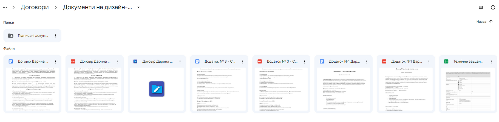

### Обміри та фотофіксація приміщення

- *все до міліметрів*

Це дозволяє отримати детальну інформацію про розміри та форму кімнат, висоту стелі, розташування вікон та дверей, а також зберегти візуальну інформацію про наявний інтер'єр. Завдяки цим даним дизайнер може розробити оптимальне планування приміщення, підібрати відповідні матеріали та меблі, а також забезпечити належну ергономіку та функціональність в просторі. Обміри та фотофіксація допомагає зменшити ризик помилок та недоліків у проекті, забезпечує **точність** та якість виконання робіт.

### Планування та 3D схеми

- *“покрутити” планування*

Плани в 2D форматі можуть бути складними для сприйняття клієнтом, оскільки вони вимагають деякого досвіду в розумінні просторової композиції та вміння читати креслення. Натомість, 3D схеми, що можна “крутити”, дозволяють клієнту краще уявити майбутній дизайн свого приміщення, побачити його з різних кутів та розглянути всі деталі, що робить проект більш зрозумілим та доступним для сприйняття. Таким чином, **3D схеми забезпечують більшу чіткість та зрозумілість проекту**, що допомагає клієнтам краще зрозуміти та оцінити майбутній функціонал свого приміщення.


  Приклад подачі з можливістю прогулянки (вам точно сподобається це, якщо ви грали в ігри в дитинстві): [3D-схема](https://autode.sk/4aC7HoO)


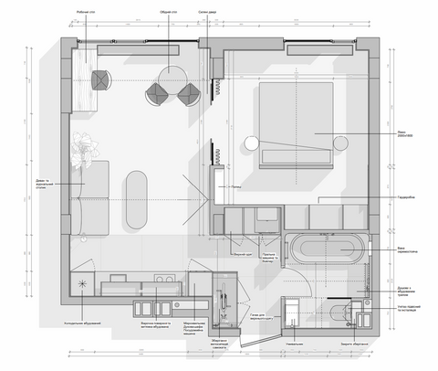

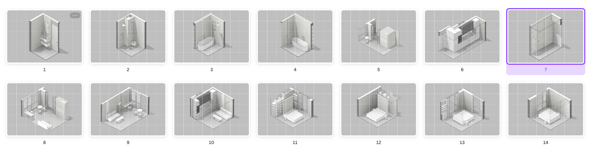

### Мудборди та підбір стилю\опрацювання ваших референсів

- *настрій, вайб, інспірація, емоція, атмосфера*

Мудборди створюються з метою візуалізації концепції та ідей дизайнера інтер'єру перед тим, як переходити до детальної розробки проекту. Вони містять зразки тканин, фарб, текстур, матеріалів та інших деталей, що допомагають клієнтам зрозуміти, як вони можуть бути використані в інтер'єрі та як будуть виглядати в комплексі. 

Мудборди забезпечують певну **єдність** в дизайні, а також допомагають дизайнеру зрозуміти, чи вдало підібрані елементи та забарвлення, і чи вони відповідають задуму та очікуванням клієнта. В результаті, мудборди є важливим етапом у процесі створення інтер'єру, який забезпечує максимальну задоволеність та ефективність роботи як дизайнера, так і клієнта. 

Що важливо — на найдовшому етапі візуалізації буде економія часу клієнта, бо він приблизно розумітиме, який очікувати результат і буде менше виправлень.

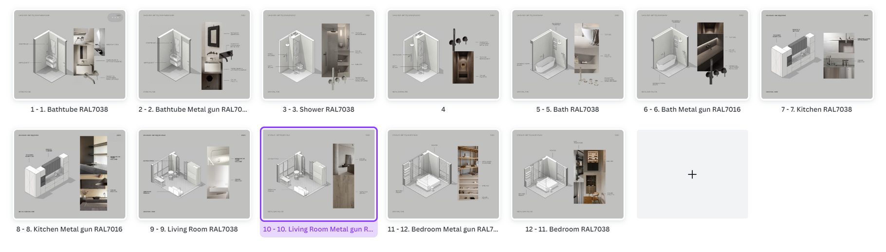

### Візуалізації

- *найприємніший етап, насправді*

Візуалізації створюються для того, щоб допомогти людям побачити, як їхні приміщення виглядатимуть після реалізації проекту. Вони дозволяють візуалізувати різні варіанти дизайну, обирати оптимальні рішення та вносити зміни до проекту. 
Візуалізації також забезпечують реалістичну оцінку масштабів, **пропорцій** та кольорів інтер'єру, що дозволяє клієнтам зробити обґрунтований вибір та отримати максимальне задоволення від свого нового приміщення.

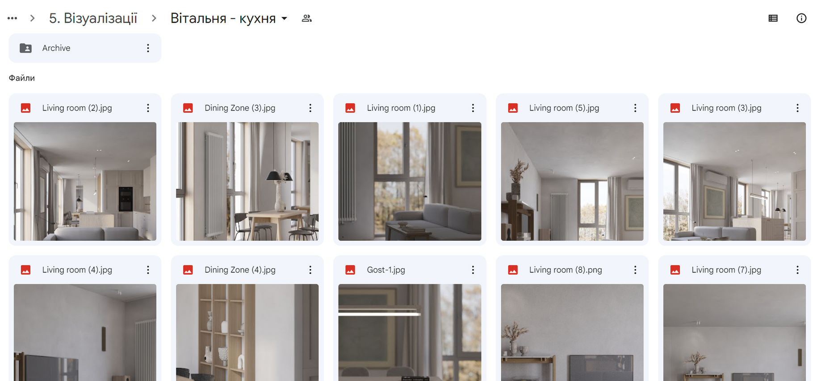

### Робочі креслення

- будівельники з кресленнями будують передбачувано

Це є, безумовно, найдовша частина процесу проектування, оскільки вона включає багато роботи та часу, витраченого на документування найдрібніших деталей дизайну столярки/корпусних меблів, розкладки плитки ванних кімнат, пакетів креслень тощо.

Створення проектної документації + графік FF&E (зазвичай це найдовша частина процесу проектування для мене). А також перевірка документації на наявність помилок.

Робочі креслення потрібні бригаді, що **вирахувати вартість робіт** та матеріалів.

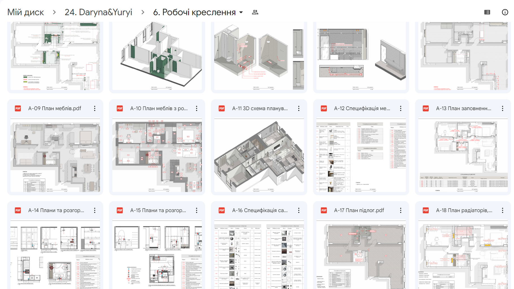

### Креслення меблів та індивідуальних елементів для підрядників

- *підрядники не зроблять вам чупакабру з діамантовими ручками*

Для кожного підрядника потрібне детальне креслення для виготовлення меблів, щоб порахувати вартість і отримати передбачуваний результат.

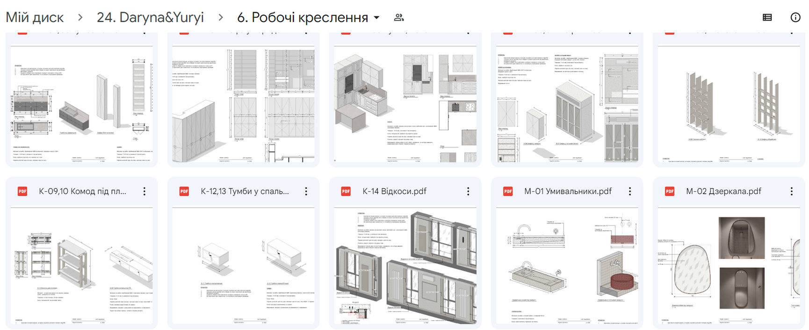

### Бюджет в гугл-таблиці

- *зменшуємо стрес*

Рахування бюджету проекту та ремонтних робіт допомагає клієнтам зробити обґрунтовані витрати, оцінити свої можливості **перед початком** та забезпечити ефективне використання коштів. Це важливий етап в процесі реалізації проекту, який дозволяє **уникнути неприємних сюрпризів** та забезпечити вчасне та якісне виконання ремонтних робіт та закупівлю необхідних матеріалів та меблів. Раціонально розподіляючи кошти та плануючи бюджет, клієнти можуть отримати більш ефективний та задовільний результат в реалізації своєї ідеї інтер'єру.

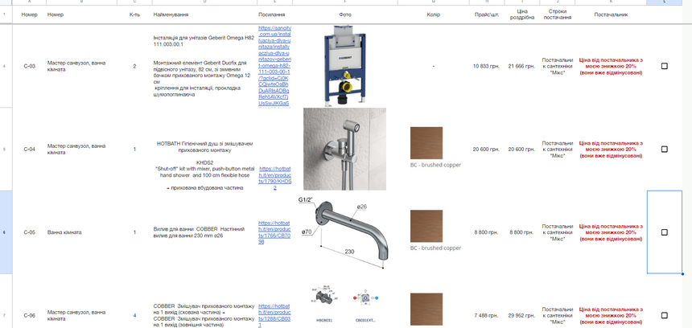

### Консультація прораба, якщо ви будете робити ремонт без авторського нагляду

- *це як бонус*

Консультація для прораба дозволяє клієнту отримати професійну допомогу та поради щодо проведення ремонтних робіт та організації робочого процесу. Консультація прораба може зменшити ризик помилок під час ремонту та допомогти **зекономити час** та кошти.

### Будівництво та нагляд

- *так, ремонт може бути в насолоду*

Деякі проекти зупиняються на етапі документації. Клієнти вирішують, що це надто важко, занадто дорого або обставини просто змінюються. Але більшість проектів переходять до фази будівництва після завершення тендерного процесу серед будівельних бригад.

Моя участь у етапі будівництва різна від проекту до проекту.

Іноді я беру активну участь, а іноді клієнти обирають продовжувати самостійно. Насправді мене влаштовує будь-який із варіантів, хоча я, як правило, бачу, що задуму дизайну дотримувалися набагато точніше, коли я брала більшу участь у будівництві, тому я обов’язково спробую взяти участь, якщо клієнт був би радий цьому.

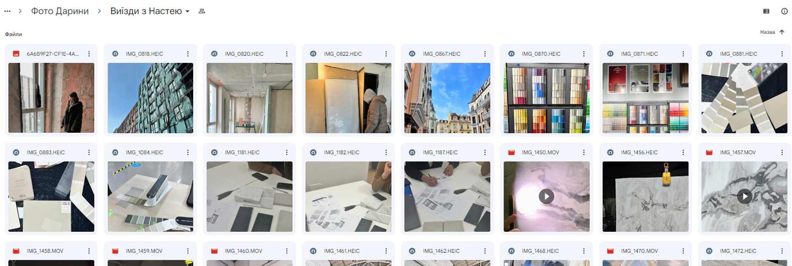

### Монтаж меблів та стилізація\підбір декору

- *це момент істини*

Це етап проекту, який передбачає встановлення меблів, стайлінг, монтаж аксесуарів. Тут я також передаю проект клієнту. Також дивлюсь, що все це було змонтовано гарно і подаю правильно дефекти підряднику, якщо потрібно.

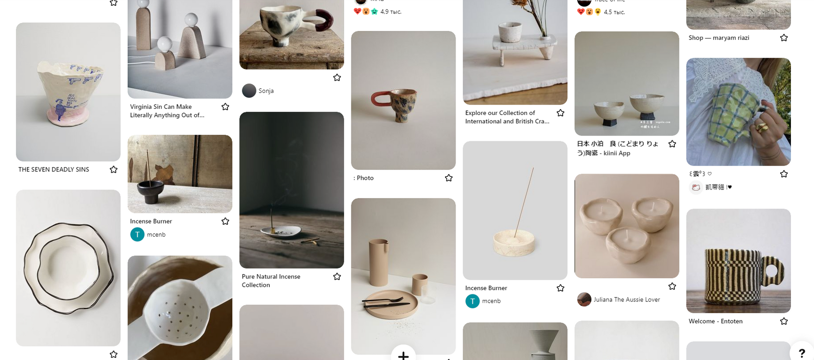

{}

  Скористайтеся калькулятором вартості проекту. Це займе всього кілька хвилин, і після розрахунку вартості, ми будемо раді з вами спілкуватися щодо деталей та відповісти на будь-які питання, які у вас можуть виникнути.
    
  
<a href=https://forms.gle/j7dEVhp2pfNFqMLs6><button type="submit" name="add" class="btn--fill w-full" data-text="Add to Cart">Калькулятор вартості</button></a>

Ми зацікавлені в тому, щоб допомогти вам створити прекрасний інтер'єр, тому давайте співпрацювати і втілювати вашу мрію!