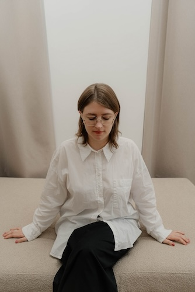

MUSO засновано в 2017 в Києві, Україна.

Раніше MUSO називалось Landusheva buro

<b>Анастасія Ткаченко</b>

Архітекторка, засновниця бюро

Анастасія – українська архітекторка, що базується в Києві, Україна. Вона отримала свою освіту на архітектурному факультеті в університеті КНУБА в Києві.

> "Моя віра в архітектуру - це віра в її тактильність і чесність. Для мене це означає відкидання зайвого і зосередження на масивних формах. Кожен мій проект виходить з ретельного вивчення контексту. Вкладення страсті у кожну роботу є для мене основою, і я прагну створювати атмосферу, яка виводить нас із метушливого світу, де ми зараз живем. Моя мета - дати комфорт людині як під час проектування, та і під час буття в просторі. Я не відмовляюся від технологій, проте вважаю, що баланс між майбутнім, сьогоденням та минулим приносить автентичність простору."
